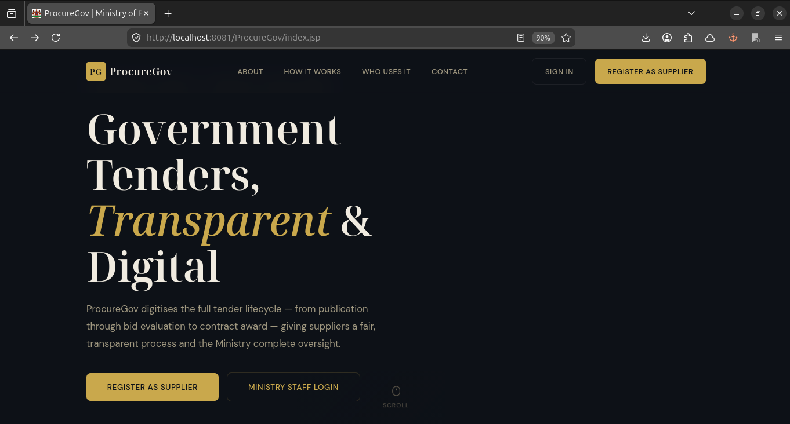
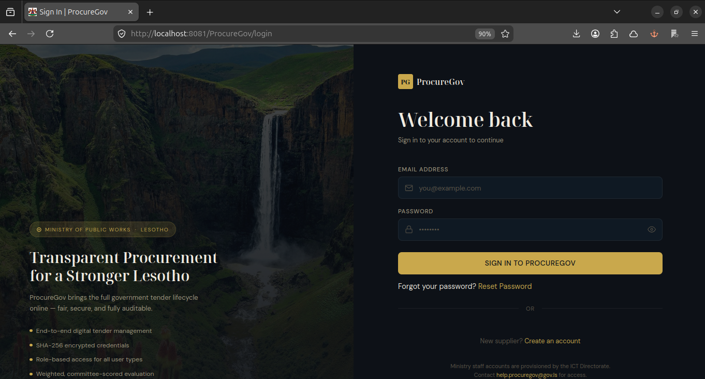
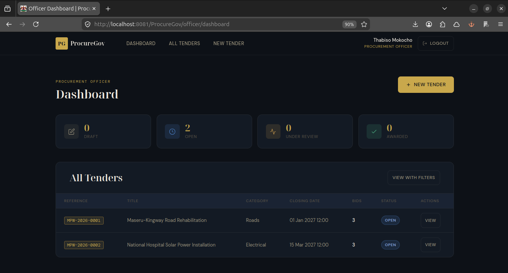
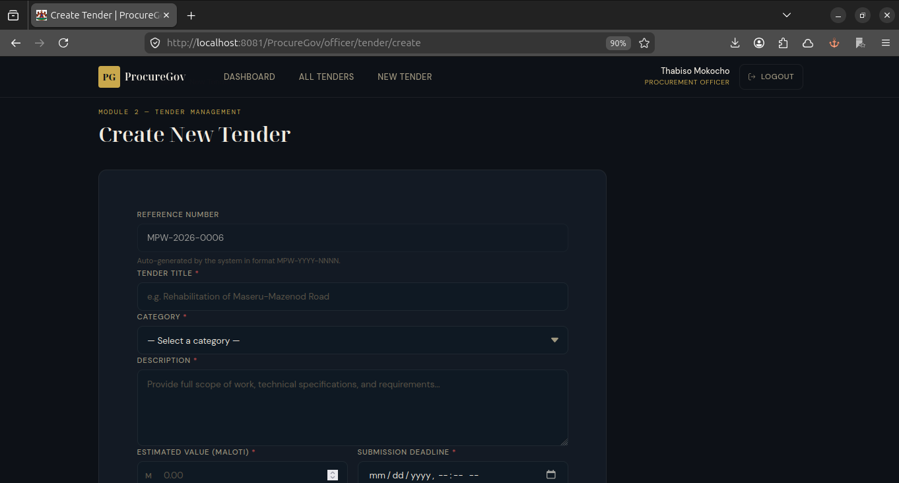
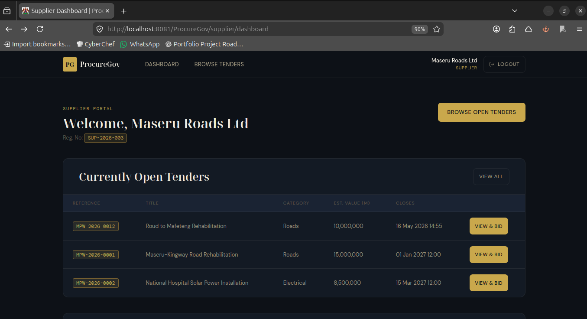
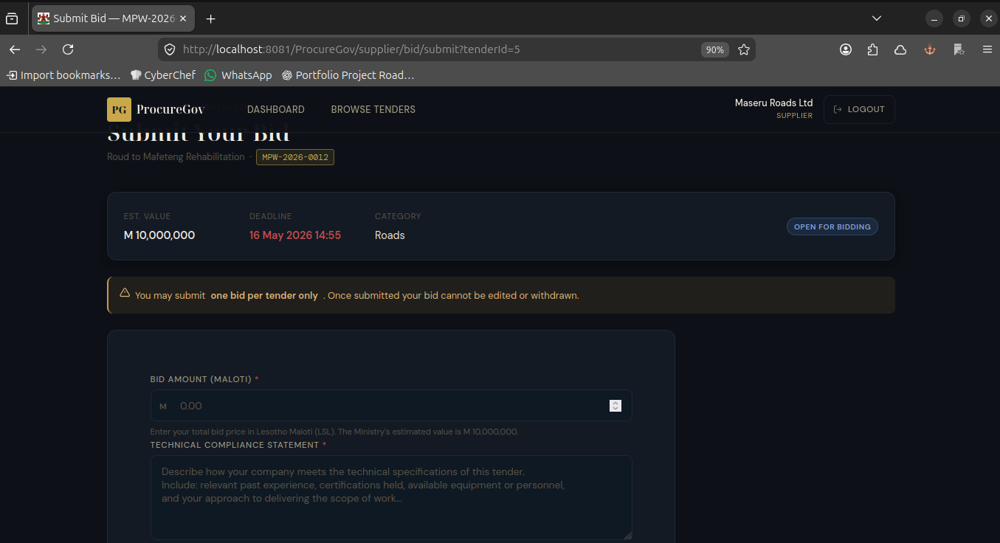
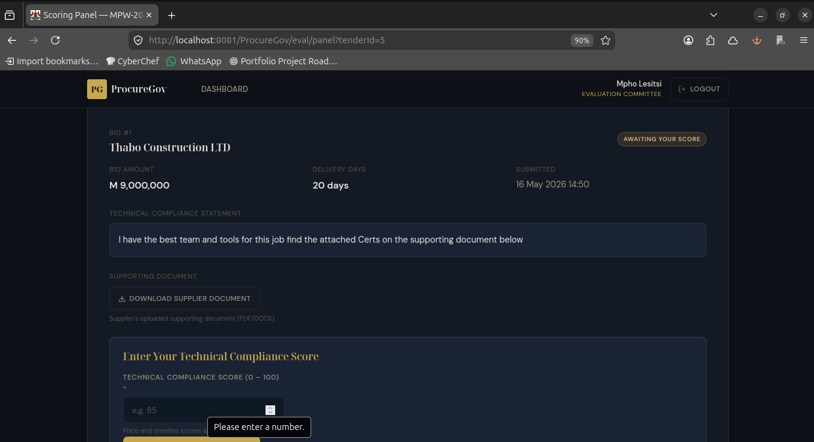
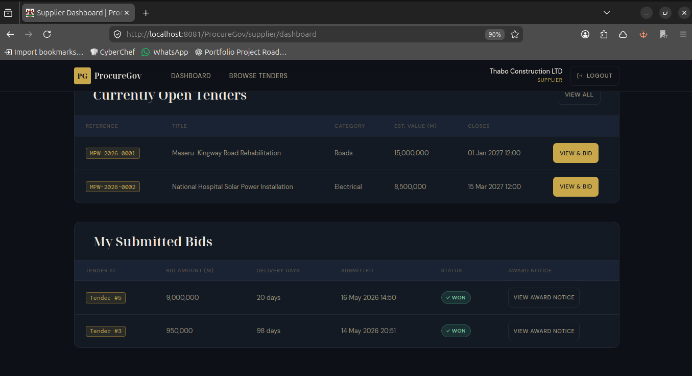
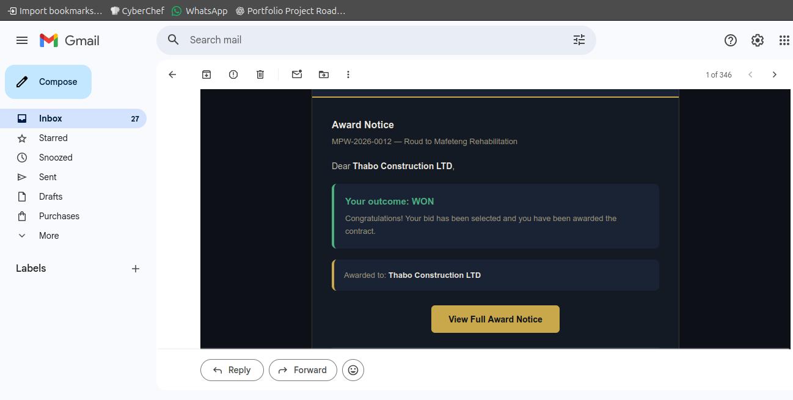

ProcureGov Government Tender Management System

Ministry of Public Works Kingdom of Lesotho

Version: 1.0
Date: 01 May 2026
Author: Neo Leseme


 **1. Project Overview**

 1.1 Purpose
ProcureGov is a full-stack J2EE web application designed to digitise the complete government tender lifecycle for the Ministry of Public Works of the Kingdom of Lesotho. It replaces paper-based submissions, physical notice boards, and email correspondence with a secure, role-controlled web portal that manages tenders from publication through to formal contract award.

 1.2 Key Features
- Role-Based Access Control: Three distinct user roles Procurement Officer, Evaluation Committee Member, and Supplier each with dedicated dashboards and permissions.
- Tender Lifecycle Management: Full lifecycle tracking from Draft → Open → Closed → Under Evaluation → Evaluated → Awarded with enforced forward-only transitions.
- Sealed Electronic Bidding: Suppliers submit bids with supporting documents (PDF/DOCX) through a secure portal with server-side closing date enforcement.
- Weighted Evaluation Scoring: Automated 40/35/25 scoring model (Price/Technical/Timeline) with multi-evaluator averaging and ranked leaderboard.
- Automatic Tender Closure: Server-side status enforcement of bid submission deadlines when tenders are accessed or processed.
- Email Notifications: JavaMail API integration for award outcome notifications sent on background daemon threads.
- Secure Authentication: SHA-256 password hashing, session-based lockout after 3 failed attempts, and password reset via 6-digit email verification codes.
- File Upload/Download: Servlet Part API for tender notice and bid document uploads; dedicated download servlet that never exposes server filesystem paths.
- Database Connection Pooling: Tomcat JNDI DataSource with Apache DBCP2 no DriverManager.getConnection() calls in application code.
- MVC Architecture: Clean separation of concerns Servlets (Controllers), JSPs with JSTL (Views), JavaBeans & DAOs (Model).


 **2. Technical Architecture**

 2.1 Technology Stack

| Component | Technology | Purpose |
|-----------|------------|---------|
| Frontend | JSP, JSTL, HTML5, CSS3, Vanilla JavaScript | Server-rendered views with custom dark-themed UI |
| Backend | Java Servlets (J2EE), JavaBeans | Controller layer, business logic, request routing |
| Database | MySQL 8.x / MariaDB | Persistent storage for users, tenders, bids, scores |
| Connection Pool | Apache DBCP2 via Tomcat JNDI | JDBC connection management |
| Security | SHA-256 Hashing (custom PasswordUtil) | Password encryption and verification |
| File Upload | Servlet Part API | Multipart file handling without third-party libraries |
| Email | JavaMail API (javax.mail) | Award notification and password reset emails |
| Web Server | Apache Tomcat 9.x | Servlet container and JSP engine |
| Build Tool | Apache Ant (via NetBeans IDE) | Compilation, WAR packaging |

 2.2 System Architecture Diagram

```
[Client Browser]
       |
       | HTTP/HTTPS (JSP + JSTL Views)
       v
[Apache Tomcat 9.x]
       |
       | Servlet Dispatch (web.xml URL Mappings)
       v
[Controller Layer Servlets]
   |      |        |      |
   | Auth | Tender | Bid  | Evaluation
   v      v        v      v
[Model Layer DAOs + JavaBeans]
   |           |
   | JNDI      | Business Logic
   v           v
[Apache DBCP2 Connection Pool]
   |
   | JDBC
   v
[MySQL / MariaDB Database]
   ^
   |
   | JavaMail API (SMTP)
   v
[Gmail SMTP Server]
```

 2.3 MVC Pattern Implementation

| Layer | Component | Responsibility |
|-------|-----------|----------------|
| Model | JavaBeans (User, Tender, Bid, EvaluationScore, AwardNotice) | Data carriers, pure POJOs |
| Model | DAO Interfaces + Implementations | Database operations, SQL, connection pooling |
| Model | Utility Classes (EvaluationService, PasswordUtil, EmailService) | Business logic, scoring calculations, hashing |
| View | JSP Pages (under WEB-INF/views/) | HTML rendering with JSTL no Java scriptlets |
| Controller | Servlets (AuthServlet, TenderServlet, BidServlet, EvalServlet, FileDownloadServlet) | Request handling, validation, routing, session management |

 2.4 Database Schema

The database contains 10 related tables in 3rd Normal Form:

Users & Authentication Tables:
- users System accounts for all three roles
- login_attempts Failed login tracking with foreign key cascade
- password_reset_codes Time-limited 6-digit reset codes

Supplier Tables:
- suppliers Company details linked to user accounts
- tender_reference_seq Atomic reference number generation

Tender Management Tables:
- tenders Full tender lifecycle with status enum
- bids Supplier bids with unique constraint per tender
- award_notices Formal contract award records

Evaluation Tables:
- evaluators Committee member appointments per tender
- evaluation_scores Individual evaluator scores with price, technical, and timeline components

### To Clone This Project
Use this:
  ```bash
 git clone https://github.com/Neo-Leseme/procuregov-tender-management-system.git
  ```
Then enter the project folder:
```bash
 cd procuregov-tender-management-system
```
To check it cloned correctly:
 ```bash
  ls
```
You should see files/folders like:
```bash
README.md
src/
web/
SQL Schema/
Project Documentation/
build.xml
nbproject/
```
 **3. Installation Guide**

 3.1 Prerequisites

**For Windows Users:**
- XAMPP for Windows (includes MySQL/MariaDB/Tomcat) 
- Java JDK 11 or later (17 recommended) available from [oracle.com](https://www.oracle.com/java/technologies/downloads/)

**For Linux Users:**
- Download tomcat9.x
```bash
curl -O https://archive.apache.org/dist/tomcat/tomcat-9/v9.0.85/bin/apache-tomcat-9.0.85.tar.gz
sudo mkdir -p /opt/tomcat9
sudo tar -xzf apache-tomcat-9.0.85.tar.gz -C /opt/tomcat9 --strip-components=1
sudo chown -R $USER:$USER /opt/tomcat9
```
- XAMPP for Linux (/opt/lampp) available from (https://www.apachefriends.org/download.html)
- Download Java JDK 17
 ```bash
  sudo apt install openjdk-17-jdk
  ```
- Build tools
 ```bash
  sudo apt install build-essential ant
  ```

 3.2 Installation Steps **(Windows)**

Step 1: Set Up the Database
1. Open the XAMPP Control Panel.
2. Click Start next to MySQL.
3. Verify MySQL shows "Running" in green.
4. Open a web browser and navigate to http://localhost/phpmyadmin.
5. Click the Import tab at the top.
6. Click Choose File and select the SQL Schema/schema.sql file from the project.
7. Click Go at the bottom of the page.
8. You should see a success message: "Import has been successfully finished".

 3.3 Installation Steps **(Linux)**

Step 1: Set Up the Database
``` bash  
 # Start XAMPP
sudo /opt/lampp/lampp start
```

 Verify MySQL is running
```bash
sudo /opt/lampp/lampp status
```

 Import the database schema
```bash
cd /path/to/ProcureGov
/opt/lampp/bin/mysql -u root < "SQL Schema/schema.sql"
```


Step 2: Configure Email **(Important)**

ProcureGov reads SMTP configuration from environment variables. Do not hard-code real email credentials inside `EmailService.java`.

**Linux:**
Place the email environment variables in Tomcat’s ```setenv.sh```.

Run this:
 ```bash
    sudo nano /opt/tomcat9/bin/setenv.sh
 ```
Paste this inside:
```bash
#!/bin/bash

export PROCUREGOV_SMTP_HOST="smtp.gmail.com"
export PROCUREGOV_SMTP_PORT="587"
export PROCUREGOV_SMTP_USER="your.email@gmail.com"
export PROCUREGOV_SMTP_PASSWORD="your-16-character-app-password"
export PROCUREGOV_FROM_NAME="ProcureGov System"
```
Replace these two:
```
your.email@gmail.com
your-16-character-app-password
```
with your real **Gmail** address and your **Gmail App Password**, not your normal Gmail password. refer to **App Password**

To save:
 ```bash
  CTRL + O
  Enter
  CTRL + X
 ```
Make it executable:
 ```bash
  sudo chmod +x /opt/tomcat9/bin/setenv.sh
```
Restart Tomcat after setting these variables.

```bash
   /opt/tomcat9/bin/shutdown.sh
  /opt/tomcat9/bin/startup.sh
```

**Windows PowerShell:**

```powershell
setx PROCUREGOV_SMTP_HOST "smtp.gmail.com"
setx PROCUREGOV_SMTP_PORT "587"
setx PROCUREGOV_SMTP_USER "your.email@gmail.com"
setx PROCUREGOV_SMTP_PASSWORD "your-16-character-app-password"
setx PROCUREGOV_FROM_NAME "ProcureGov System"
```

Restart Tomcat after setting these variables.

  **App Password**  
To generate an App Password: Google Account → Security → 2-Step Verification → App Passwords.

Step 3: Rebuild the WAR file. 

 **4.  Deployment Guide.**
  
Step 1.1: Deploy the WAR File On XAMPP **(Windows)**
1. Locate the dist/ProcureGov.war file in the project folder.
2. Copy the WAR file to your XAMPP\tomcat webapps folder:

  ``` C:\xampp\tomcat\webapps\ ```

4. If Tomcat is already running, it will auto-deploy the WAR within a few seconds.

Step 1.1.1: Start Tomcat (if not already running)
1. Open the XAMPP Control Panel.
2. Click Start next to Tomcat.
3. Verify Tomcat shows "Running" in green.
4. Monitor Real-Time Logs (Optional)
  Watch Tomcat logs in real time.
cmd:
```
 cd C:\xampp\tomcat\logs
 type catalina.out
```

Step 1.2: Deploy the WAR File **(Linux)**
 ```bash
 # Stop Tomcat if running
 /opt/tomcat9/bin/shutdown.sh
```

 Copy the WAR file to Tomcat
```
 cd /path/to/ProcureGov
 sudo cp dist/ProcureGov.war /opt/tomcat9/webapps/
```

 Start Tomcat
```
 /opt/tomcat9/bin/startup.sh
```

 Watch the logs to verify deployment (Optional)
```
  tail -f /opt/tomcat9/logs/catalina.out
```

Step 4: Access the Application (Windows and Linux)
1. Open a web browser.
2. Navigate to: http://localhost:8080/ProcureGov/
3. Click Sign In to access the login page.
4. Use the credentials from Section 5 to log in.


  **5. Predefined User Credentials**

Password for ALL accounts: Password123!

|   | Full Name | Email | Role |
|---|-----------|-------|------|
| 1 | Thabiso Mokocho | thabiso@mpw.ls | Procurement Officer |
| 2 | Lineo Ntšekhe | lineo@mpw.ls | Procurement Officer |
| 3 | Mpho Lesitsi | mpho@mpw.ls | Evaluation Committee Member |
| 4 | Palesa Mohapi | palesa@mpw.ls | Evaluation Committee Member |
| 5 | Neo Leseme | neo@build.ls | Supplier |
| 6 | Tse-Tse Builders | tse@build.ls | Supplier |
| 7 | Maseru Roads Ltd | maseru@roads.ls | Supplier |

> Note: Ministry staff accounts (Procurement Officer, Evaluation Committee Member) are pre-seeded via the database script and cannot be self-registered. Supplier accounts can be created via the Create an account link on the login page.


 **6. User Roles & Access**

 6.1 Procurement Officer
- Create, edit, and publish tenders with auto-generated reference numbers (MPW-YYYY-NNNN)
- Manage the full tender lifecycle with enforced forward-only status transitions
- Upload tender notice PDFs via the Servlet Part API
- Participate in bid evaluation alongside Evaluation Committee Members
- View ranked bid leaderboards after all evaluators have scored
- Award contracts to the highest-scoring bidder with formal justification
- Generate award notices visible to all bidding suppliers

 6.2 Evaluation Committee Member
- View tenders in Closed and Under Evaluation status
- Score each bid using three weighted criteria:
  - Price Score (40%) auto-calculated by the system
  - Technical Compliance Score (35%) manually entered (0–100)
  - Delivery Timeline Score (25%) auto-calculated by the system
- Cannot view other evaluators' scores until submitting their own
- Access the evaluation dashboard with real-time status updates

 6.3 Supplier
- Register an account with company details and contact information
- Browse and download open tender notices
- Submit one sealed bid per tender with a supporting document (PDF/DOCX)
- Track bid status through the evaluation lifecycle
- View award notices after contract award
- Receive email notifications on award outcomes (WON / NOT WON)


 **7. Project Structure**

```
ProcureGov/
│
├── src/java/com/
│   ├── controller/              ← Servlets (MVC Controllers)
│   │   ├── AuthServlet.java         Authentication & password reset
│   │   ├── TenderServlet.java       Tender CRUD & lifecycle management
│   │   ├── BidServlet.java          Supplier bid submission
│   │   ├── EvalServlet.java         Bid evaluation & contract award
│   │   ├── FileDownloadServlet.java Secure file streaming
│   │   └── NotifyServlet.java       Future notification endpoint
│   │
│   ├── dao/                     ← Data Access Objects
│   │   ├── UserDAO.java / UserDAOImpl.java
│   │   ├── TenderDAO.java / TenderDAOImpl.java
│   │   ├── BidDAO.java / BidDAOImpl.java
│   │   ├── EvalDAO.java / EvalDAOImpl.java
│   │   ├── AwardDAO.java / AwardDAOImpl.java
│   │   └── DBConnection.java         JNDI DataSource helper
│   │
│   ├── model/                   ← JavaBeans (Data Model)
│   │   ├── User.java
│   │   ├── Supplier.java
│   │   ├── Tender.java
│   │   ├── Bid.java
│   │   ├── EvaluationScore.java
│   │   └── AwardNotice.java
│   │
│   └── util/                    ← Utility & Service Classes
│       ├── SessionUtil.java          Session management & role guards
│       ├── PasswordUtil.java         SHA-256 password hashing
│       ├── EvaluationService.java    Weighted scoring calculations
│       ├── EmailService.java         JavaMail email notifications
│       └── ReferenceGenerator.java   Tender reference number generator
│
├── web/
│   ├── index.jsp                ← Landing page
│   ├── css/style.css            ← Shared stylesheet
│   ├── images/                  ← Logos and static assets
│   ├── META-INF/
│   │   └── context.xml          ← JNDI DataSource configuration
│   └── WEB-INF/
│       ├── web.xml              ← Servlet mappings, error pages, session config
│       ├── lib/                 ← Required JAR files
│       └── views/               ← All JSP pages (protected not directly accessible)
│           ├── auth/            ← Login, register, forgot password, verify code, reset password
│           ├── officer/         ← Dashboard, tender form, tender list, tender detail, eval panel, award form
│           ├── supplier/        ← Dashboard, browse tenders, tender detail, bid form, award notice
│           ├── eval/            ← Eval dashboard, scoring panel
│           └── common/          ← Navbar, error pages (404, 500)
│
├── SQL Schema/
│   └── schema.sql               ← Complete database creation + seed data (single file)
│
├── dist/
│   └── ProcureGov.war     ← Compiled deployable WAR
│
├── Project Documentation/
│   └── javadoc/
│   └── ProcureGovERD.drawio 
│   └── ProcureGovMVC.drawio
│   └── ProcureGovUSECASE.drawio 
│
└── README.md                    ← This document
```

 **8. Usage Guide**

 8.1 Logging In
1. Navigate to the login page at /ProcureGov/login.
2. Enter your email and password (see Section 5 for predefined credentials).
3. Upon successful authentication, you will be redirected to your role-specific dashboard.
4. After 3 consecutive failed login attempts, the session is temporarily locked. Wait 30 seconds, then refresh and try again. 

 8.2 Creating a Tender (Procurement Officer)
1. Log in as a Procurement Officer.
2. From the dashboard, click New Tender.
3. Fill in all fields: title, category, description, estimated value, and closing date/time.
4. Upload a required tender notice PDF (max 5 MB).
5. The reference number (MPW-YYYY-NNNN) is generated automatically.
6. The tender is created in Draft status. Click Publish Tender to make it visible to suppliers.

 8.3 Submitting a Bid (Supplier)
1. Log in as a Supplier.
2. Browse open tenders from the supplier dashboard.
3. Click on a tender to view details, then click Submit Bid.
4. Enter the bid amount (Maloti), technical compliance statement (max 600 characters), and delivery timeline (days).
5. Upload a required supporting document (PDF/DOCX, max 10 MB).
6. Each supplier may only submit one bid per tender.

 8.4 Evaluating Bids (Procurement Officer & Evaluation Committee)
1. A Procurement Officer moves the tender to Under Evaluation status.
2. All Procurement Officers and Evaluation Committee Members are appointed as evaluators.
3. Evaluators access the Scoring Panel to enter Technical Compliance Scores (0–100).
4. Price Scores and Timeline Scores are auto-calculated by the system.
5. Evaluators cannot view other evaluators' scores until they submit their own.
6. Once all evaluators have scored all bids, the system auto-transitions to Evaluated.

 8.5 Awarding a Contract (Procurement Officer)
1. From the Evaluation Panel, an officer views the ranked leaderboard.
2. The system automatically determines the winner (highest composite score).
3. The officer enters an official justification and confirms the award.
4. All bidding suppliers are notified via email on a background thread.
5. The award notice becomes visible to all suppliers who bid on that tender.

 8.6 Resetting a Forgotten Password
1. On the login page, click Forgot your password?
2. Enter your registered email address.
3. A 6-digit verification code is sent to your inbox (check spam if not received).
4. Enter the code on the verification page.
5. Set a new password (minimum 8 characters).
6. You will be redirected to the login page to sign in with your new password.


 **9. Testing Checklist**

Use this checklist to verify all components are functioning correctly after deployment.

Authentication & Session Management
- [ ] Login page loads without errors
- [ ] Can log in with each predefined user account
- [ ] Invalid credentials show an appropriate error message
- [ ] Session lockout activates after 3 consecutive failed attempts
- [ ] Logout invalidates the session and redirects to login
- [ ] Protected pages redirect unauthenticated users to login with "Access Denied"

Supplier Registration
- [ ] Can register a new supplier account with all mandatory fields
- [ ] Duplicate email addresses are rejected
- [ ] Password mismatch is detected
- [ ] Registration number is auto-generated in SUP-YYYY00NN format

Tender Management
- [ ] Can create a tender with all fields
- [ ] Reference number is auto-generated (MPW-YYYY-NNNN)
- [ ] Can upload a tender notice PDF
- [ ] Draft tenders can be edited; published tenders cannot
- [ ] Status transitions enforce valid forward-only paths
- [ ] Tenders auto-close when the closing datetime passes


Bid Submission
- [ ] Open tenders are visible on the supplier dashboard
- [ ] Can submit a bid with all required fields
- [ ] Duplicate bid attempts are blocked with a clear message
- [ ] Bid submission is rejected after the closing datetime (server-side)
- [ ] Supporting documents (PDF/DOCX) can be uploaded and downloaded

Bid Evaluation
- [ ] Evaluators can access the scoring panel for tenders in Under Evaluation
- [ ] Technical score entry accepts values 0–100
- [ ] Price and Timeline scores are auto-calculated correctly
- [ ] Evaluators cannot see other scores before submitting their own
- [ ] Auto-transition to Evaluated triggers when all evaluators have scored all bids

Contract Award
- [ ] Ranked leaderboard displays after all scores are submitted
- [ ] System automatically selects the highest-scoring bid
- [ ] Award requires a justification note
- [ ] Award notice is generated and visible to all bidding suppliers

Email Notifications
- [ ] On Tender publication all suppliers are notified 
- [ ] Once a Tender Progress To Evaluation all Evaluators are notified
- [ ] Award outcome emails are sent to all bidding suppliers
- [ ] Emails include tender reference, WON/NOT WON outcome, and link to award notice
- [ ] Password reset emails are delivered with valid 6-digit codes

File Downloads
- [ ] Tender notice PDFs download correctly
- [ ] Bid documents (PDF and DOCX) download with correct file extensions
- [ ] Unauthorised users cannot download restricted documents


 **10. Troubleshooting**

 10.1 Common Issues

Issue: "DataSource acquired from JNDI" not appearing in logs
- Cause: Database connection pool not configured or MySQL not running.
- Solution:
  1. Verify MySQL is running:green status on (XAMPP)
  2. Check META-INF/context.xml inside the WAR for correct JDBC URL
  3. Verify WEB-INF/web.xml has the <resource-ref> for jdbc/ProcureGovDB

Issue: Tender auto-closes immediately on publish
- Cause: Timezone mismatch between Java application (Africa/Maseru, UTC+2) and MySQL server (UTC).
- Solution:
  1. Verify serverTimezone=Africa%2FMaseru in the JDBC URL inside context.xml
  2. Adjust the timezone identifier to match your server's location if outside Lesotho
  3. The closeExpiredTenders() method includes a 1-minute grace period as an additional safeguard

Issue: Email notifications not sending
- Cause: Gmail SMTP credentials not configured or App Password not generated.
- Solution:
  1. Verify the SMTP environment variables are correctly set.
  2. Ensure 2-Step Verification is enabled on the Google account
  3. Generate a new App Password: Google Account → Security → App Passwords
  4. Check the Tomcat logs for email-specific warnings


 **11. Security Considerations**

 11.1 Implemented Security Measures
- Password Hashing: All passwords are hashed using SHA-256 before database storage. Plain-text passwords are never persisted.
- Prepared Statements: All database queries use JDBC PreparedStatement to prevent SQL injection attacks. No string concatenation for SQL.
- Session Management: User authentication state is maintained via server-side HttpSession. Session timeout is configured at 30 minutes.
- Role-Based Access Control: Every protected servlet calls SessionUtil.requireRole() or SessionUtil.requireLogin() before processing requests. Unauthorised access attempts redirect to login with an "Access Denied" message never a raw error page.
- Input Validation: All form inputs are validated server-side. File uploads are size-checked before database insertion.
- File Path Security: Uploaded files are served through a dedicated FileDownloadServlet server filesystem paths are never exposed to the browser.
- Password Reset Security: Reset codes are single-use, expire after 15 minutes, and are sent via email. The system never reveals whether an email address is registered.
- Account Lockout: After 3 consecutive failed login attempts, the session is locked. The login_attempts table tracks persistent failures.

 11.2 Configuration for Production Deployment
- Database Password: The seed data uses an empty root password. In production, set a strong MySQL root password and update META-INF/context.xml.
- SMTP Credentials: Move email credentials out of EmailService.java into environment variables or a .properties file excluded from version control.
- Session Cookies: Set <cookie-config><secure>true</secure></cookie-config> in web.xml when deploying over HTTPS.
- File Upload Directory: Configure an absolute path for uploadDir outside the web application directory via web.xml context parameters.
- Error Pages: Custom error pages are configured for HTTP 400, 403, 404, and 500. Verify they display Ministry-branded pages in production.

## SCREENSHOTS

### Home Page


### Login Page


### Procurement Officer Dashboard


### Create Tender


### Supplier Dashboard


### Submit Bid


### Evaluation Panel


### Award Notice


### Award Notice Email


Project Author: Neo Leseme

Document Version: 1.0 
Last Updated: 16 May 2026 
Generated for ProcureGov Ministry of Public Works, Kingdom of Lesotho

